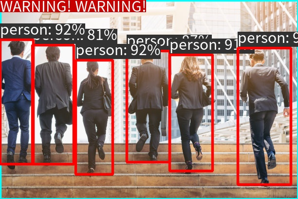

# EV_SDK说明

## 一. 说明
### EV_SDK的目标
开发者专注于算法开发及优化，最小化业务层编码，即可快速部署到生产环境，共同打造商用级高质量算法。
### 极市平台做了哪些
1. 统一定义算法接口：针对万千视频和图片分析算法，抽象出核心接口，定义在`include`目录下的`ji.h`文件中
2. 提供工具包：比如wkt库，在`3rd`目录下
3. 应用层服务：此模块不在ev_sdk中，比如视频处理服务、算法对外通讯的http服务等

### 开发者需要做什么
1. 模型的训练和调优
2. 实现`ji.h`约定的接口
3. 实现约定的输入输出
4. 其他后面文档提到的功能

## 二. 采用EVDeploy开发EV_SDK的一般步骤(开发者重点关注的部分)

1. 下载下载EVDeploy的release版, **git clone https://gitee.com/cvmart/evdeploy_release**, 执行一键安装脚本:
```
        cd evdeploy_release
        bash install.sh
```
2. 获取evdeploy_release/demos下的demo源码,将源码拷贝至目标路径/usr/local/ev_sdk（**注意！！！在平台上的ev_sdk目录是一个git工程目录,内含隐藏的git文件,不可删除**）, 以ev_sdk_demo4.0_evdeploy_trt为例:
```
        cp -r evdeploy_release/demos/ev_sdk_demo4.0_evdeploy_trt/* /usr/local/ev_sdk
```

3. 修改EVDeploy的配置文件/usr/local/ev_sdk/config/evdeploy_config.json,如下
```
        {    
                "model_lib_path":["/usr/local/evdeploy/x86_64/lib/libtrt.so"],       
                "serving_models":
                [        
                        {   
                        "mode":"local_model",
                        "type": "common",
                        "engine":"trt",
                        "framework":"",
                        "version": "v1",
                        "inputs":["images"],
                        "outputs":["output"],
                        "model":"/usr/local/ev_sdk/model/yolov5s_encrypt.onnx",
                        "uuid":"200003"
                        }
                ]
        }
```
        重点需要修改的地方是:

        1)模型路径"model"字段内容,EVDeploy工具一般统一以onnx模型作为输入的模型格式;  
        2)模型标志"uuid"字段内容,可自行设置,建议是6位数字的字符串,当有多个模型时,保证每个模型的uuid唯一;  
        3)推理引擎"engine"字段内容,tensorrt为trt, Ascend为atlas, OpenVINO为ov;  
        4)模型输入"inputs"字段内容,对于某些推理引擎,比如trt,要求输入模型的输入节点名称,当有多个输入时,逗号间隔(onnx模型可以通过可视化工具查看输入节点的名称);  
        5)模型输出"outputs"字段内容,对于某些推理引擎,比如trt,要求输入模型的输出节点名称,当有多个输出时,逗号间隔(onnx模型可以通过可视化工具查看输出节点的名称);


4. 修改/usr/local/ev_sdk/src/ji.cpp中的ji_init函数和ji_reinit函数
```
        JiErrorCode ji_init(int argc, char **argv)
        {
                // 根据配置文件初始化EVDeploy
                EVDeploy::GetModel().InitModel("/usr/local/ev_sdk/config/evdeploy_config.json");
                // 创建配置文件中uuid对应的模型实例,当有多个时,分别创建多个
                EVDeploy::GetModel().CreateModel("200003");//注意uuid可与配置文件中保持一致

                return JISDK_RET_SUCCEED;
        }

        void ji_reinit()
        {
                // 释放配置文件中uuid对应的模型资源,当有多个时,分别释放多个
                EVDeploy::GetModel().DestroyModel("200003");//注意uuid与创建时一致
                
                return;
        }
```

5. 修改/usr/local/ev_sdk/src/sample_detector.h和/usr/local/ev_sdk/src/sample_detector.cpp; 这两个文件主要是封装一个SampleDetector的类,在这个类中完成一个模型分析处理一张图片的过程, 主要修改的函数是SampleDetector::ProcessImage:
```
        bool SampleDetector::ProcessImage(const cv::Mat &img, std::vector<ev::vision::BoxInfo> &det_results)
        {
                det_results.clear();
                cv::Mat cv_in_mat1;
                //前处理,可能需要自定义实现
                m_preprocessor.Run(const_cast<cv::Mat&>(img), cv_in_mat1, 640);

                //准备输入数据
                EVModelData in;
                EVModelData out;
                EVMatData in_mat;

                in.desc = NULL;
                in.mat = &in_mat;

                in.mat_num = 1; // 输入图像数量,也可以是多张;如果是多张,则in.mat为数组指针

                in_mat.data = cv_in_mat1.data;
                in_mat.data_size = cv_in_mat1.cols * cv_in_mat1.rows * 3 * 4;
                in_mat.width = cv_in_mat1.cols;
                in_mat.height = cv_in_mat1.rows;
                in_mat.aligned_width = cv_in_mat1.cols;
                in_mat.aligned_height = cv_in_mat1.rows;
                in_mat.channel = 3;
                in_mat.loc = EV_DATA_HOST;
                in_mat.type = EV_UINT8;

                //执行推理
                std::lock_guard<std::mutex> lock_guard(m_mutex);//用于多线程时,线程安全
                EVDeploy::GetModel().RunInfer(m_uuid, &in, &out);
                SDKLOG(INFO) << "RunInfer done";
                // 输出的数量由out.mat_num指示,输出的数据封装在out.mat中,如果是多个输出,则out.mat为指向多个输出的指针,
                // 每一个输出的维度信息由out.mat[i]->dims指示
                // 每一个输出的名称信息由out.mat[i]->desc指示
                for (int j = 0; j < out.mat_num; ++j)
                {
                        SDKLOG(INFO) << "output name: " << out.mat[j].desc;
                        for (int k = 0; k < out.mat[j].dims.size(); ++k)
                        {
                                SDKLOG(INFO) << "dims " << k << ":" << out.mat[j].dims[k];
                        }
                }

                //后处理,可能需要自定义实现   
                float scale = m_preprocessor.GetScale();
                m_postprocessor.Run(out.mat, det_results, scale, m_thresh, img.cols, img.rows);

                // 注意释放out.mat,否则会有内存泄露!!!!
                if (out.mat)
                {
                        delete[] out.mat;
                }

                return true;
}
```
        !!!注意!!!:重点需要修改的地方是前处理和后处理部分,EVDeploy只实现了部分常用的前处理和后处理,可直接调用,但不同的模型,前后处理均不相同,开发者需要根据自己的模型要求去实现前处理和后处理,自定义实现可直接在SampleDetector的类中去实现


6. 修改算法业务逻辑代码,主要是/usr/local/ev_sdk/sample_algorithm.h和/usr/local/ev_sdk/sample_algorithm.cpp, 实现的是算法业务逻辑的SampleAlgorithm类. 基本的关系是ji.cpp调用SampleAlgorithm类, SampleAlgorithm类调用模型分析SampleDetector的类.

7. 编译ev_sdk，注意修改ji.cpp中的版本号algo_version,执行完成之后，`/usr/local/ev_sdk/lib`下将生成`libji.so`和相关的依赖库，以及`/usr/local/ev_sdk/bin/`下的测试程序`test-ji-api`。需要注意的是**一定要有install,目的是将相应地库都安装到ev_sdk/lib下面**
  ```shell
        #编译SDK库
        mkdir -p /usr/local/ev_sdk/build
        cd /usr/local/ev_sdk/build
        cmake ..
        make install 
        #编译测试工具
        mkdir -p /usr/local/ev_sdk/test/build
        cd /usr/local/ev_sdk/test/build
        cmake ..
        make install 
  ```
8. 测试,我们提供了测试工具test-ji-api方便开发者进行算法的快速测试,在下面的**ev_sdk 测试**中我们将演示如何使用测试工具进行基本的测试(**这点非常重要,开发者需要先自测通过再提交算法**)

## 三. EV_SDK测试
ev_sdk编译即可运行测试工具,测试工具主要提供一下几个功能

```
        ---------------------------------
          usage:
            -h  --help        show help information
            -f  --function    test function for 
                              1.ji_calc_image
                              2.ji_calc_image_asyn
                              3.ji_destroy_predictor
                              4.ji_thread
                              5.ji_get_version
                              6.ji_insert_face
                              7.ji_delete_face
            -i  --infile      source file
            -a  --args        for example roi
            -u  --args        test ji_update_config
            -o  --outfile     result file
            -r  --repeat      number of repetitions. default: 1
                              <= 0 represents an unlimited number of times
                              for example: -r 100
        ---------------------------------

```

下面我们对部分功能进行详细的说明(未说明的参数暂未实现)

1. 指定调用功能的-f参数
    1. -f 1指调用算法同步分析接口，调用该接口时主要支持如下几种输入方式:

    ```"shell"
        1.输入单张图片，需要指定输入输出文件
        　　./test-ji-api -f 1 -i ../data/persons.jpg -o result.jpg
        
        2.输入多张图片(多张图片是指sdk一次调用ji_calc_image传入的图片数量不是指多次调用，每次传入一张图片)，需要指定输入输出文件
            　./test-ji-api -f 1 -i ../data/persons.jpg,../data/persons.jpg -o result.jpg #输入两张图片
        
        3.输入视频，需要指定输入输出文件
        　　./test-ji-api -f 1 -i ../data/test.mp4 -o test_result.mp4 

        4.输入图片文件夹，只需指定输入文件夹即可，结果图片会保存在原图片文件的同一路径下，结果文件名和原文件名一一对应(名称中添加了result字段)
        　　　./test-ji-api -f 1 -i ../data/　
             图片列表文件格式如下:   
                /usr/local/ev_sdk/data/a.jpg
                /usr/local/ev_sdk/data/b.jpg
                /usr/local/ev_sdk/data/c.png   
    ```

    2. -f 3指调用算法实例创建释放接口，该接口需要与-r参数配合使用，测试在循环创建/调用/释放的过程中是否存在内存/显存的泄露，与调用-f 1的区别在于，当-r参数指定调用次数时，-f 1只会创建一次实例，释放一次实例．

    ```'shell'
        ./test-ji-api -f 3 -i ../data/persons.jpg -o result.jpg -r -1 #无限循环调用

        ./test-ji-api -f 3 -i ../data/persons.jpg -o result.jpg -r 100 #循环调用100次
    ```

    3. -f 4多线程测试（务必测试）．

    ```'shell'
        ./test-ji-api -f 4 -i ../data/persons.jpg -r 100
    ```
    4. -f 5获取并打印算法的版本信息．

    ```'shell'
        ./test-ji-api -f 5
    ```
2. 指定输入的-i参数，使用方式见上文介绍.
3. 指定输出的-o参数，使用方式见上文介绍. 
4. 指定配置的-u/-a参数,算法初始化时会从配置文件中加载默认配置参数,对于部分参数通过接口可以动态覆盖默认参数,如果项目要求能够动态指定的参数,需要测试通过-u和-a传递的参数能够生效.例如,对于本demo的配置文件如下

    ```"json"
   {
    "draw_roi_area": true,
    
    "roi_type": "polygon_1",
    "polygon_1": ["POLYGON((0 0, 1 0, 1 1, 0 1))"],

    "roi_color": [255, 255, 0, 0.7],
    "roi_line_thickness": 4,
    "roi_fill": false,
    "draw_result": true,
    "draw_confidence": true,
    "thresh": 0.1,
    "language": "en",

    "target_rect_color": [0, 0, 255, 0],
    "object_rect_line_thickness": 3,
    "object_text_color": [255, 255, 255, 0],
    "object_text_bg_color": [50, 50, 50, 0],
    "object_text_size": 30,
    "mark_text_en": ["person"],
    "mark_text_zh": ["人体"],
    "draw_warning_text": true,
    "warning_text_en": "WARNING! WARNING!",
    "warning_text_zh": "警告!",
    "warning_text_size": 30,
    "warning_text_color": [255, 255, 255, 0],
    "warning_text_bg_color": [0, 0, 200, 0],
    "warning_text_left_top": [0, 0]
    }
    ```

配置文件中的polygon_1参数和language参数需要支持动态配置,则需要利用-a和-u参数测试,-u和-a参数的区别在于-u是通过ji_update_config接口单独传递,-i是通过ji_calc_iamge的args参数传递.
   
   ```"shell"
     //-u指定参数
        ./test-ji-api -f 1 -i ../data/persons.jpg 
        -u "{\"polygon_1\": [\"POLYGON((0.2 0.2, 0.8 0, 0.8 0.8, 0 0.8))\"],\"language\":\"zh\"}"
        -o result.jpg

    //-a指定参数
        ./test-ji-api -f 1 -i ../data/persons.jpg  
        -a "{\"polygon_1\": [\"POLYGON((0.2 0.2, 0.8 0, 0.8 0.8, 0 0.8))\"],\"language\":\"zh\"}"
        -o result.jpg
   ```

以下为默认参数的输出效果  



```
    code: 0
        json: {
        "algorithm_data" : 
        {
                "is_alert" : true,
                "target_info" : 
                [
                        {
                                "confidence" : 0.81,
                                "height" : 245,
                                "name" : "person",
                                "width" : 86,
                                "x" : 66,
                                "y" : 92
                        },
                        {
                                "confidence" : 0.87,
                                "height" : 229,
                                "name" : "person",
                                "width" : 89,
                                "x" : 260,
                                "y" : 104
                        },
                        {
                                "confidence" : 0.91,
                                "height" : 239,
                                "name" : "person",
                                "width" : 89,
                                "x" : 348,
                                "y" : 112
                        },
                        {
                                "confidence" : 0.92,
                                "height" : 235,
                                "name" : "person",
                                "width" : 77,
                                "x" : 155,
                                "y" : 123
                        },
                        {
                                "confidence" : 0.92,
                                "height" : 256,
                                "name" : "person",
                                "width" : 69,
                                "x" : 0,
                                "y" : 81
                        },
                        {
                                "confidence" : 0.94,
                                "height" : 281,
                                "name" : "person",
                                "width" : 110,
                                "x" : 488,
                                "y" : 98
                        }
                ]
        },
        "model_data" : 
        {
                "objects" : 
                [
                        {
                                "confidence" : 0.81,
                                "height" : 245,
                                "name" : "person",
                                "width" : 86,
                                "x" : 66,
                                "y" : 92
                        },
                        {
                                "confidence" : 0.87,
                                "height" : 229,
                                "name" : "person",
                                "width" : 89,
                                "x" : 260,
                                "y" : 104
                        },
                        {
                                "confidence" : 0.91,
                                "height" : 239,
                                "name" : "person",
                                "width" : 89,
                                "x" : 348,
                                "y" : 112
                        },
                        {
                                "confidence" : 0.92,
                                "height" : 235,
                                "name" : "person",
                                "width" : 77,
                                "x" : 155,
                                "y" : 123
                        },
                        {
                                "confidence" : 0.92,
                                "height" : 256,
                                "name" : "person",
                                "width" : 69,
                                "x" : 0,
                                "y" : 81
                        },
                        {
                                "confidence" : 0.94,
                                "height" : 281,
                                "name" : "person",
                                "width" : 110,
                                "x" : 488,
                                "y" : 98
                        }
                ]
        }
    }
```

以下为指定参数的输出效果  


```"json"
 code: 0
        json: {
        "algorithm_data" : 
        {
                "is_alert" : true,
                "target_info" : 
                [
                        {
                                "confidence" : 0.81,
                                "height" : 245,
                                "name" : "人体",
                                "width" : 86,
                                "x" : 66,
                                "y" : 92
                        },
                        {
                                "confidence" : 0.87,
                                "height" : 229,
                                "name" : "人体",
                                "width" : 89,
                                "x" : 260,
                                "y" : 104
                        },
                        {
                                "confidence" : 0.91,
                                "height" : 239,
                                "name" : "人体",
                                "width" : 89,
                                "x" : 348,
                                "y" : 112
                        },
                        {
                                "confidence" : 0.92,
                                "height" : 235,
                                "name" : "人体",
                                "width" : 77,
                                "x" : 155,
                                "y" : 123
                        }
                ]
        },
        "model_data" : 
        {
                "objects" : 
                [
                        {
                                "confidence" : 0.81,
                                "height" : 245,
                                "name" : "人体",
                                "width" : 86,
                                "x" : 66,
                                "y" : 92
                        },
                        {
                                "confidence" : 0.87,
                                "height" : 229,
                                "name" : "人体",
                                "width" : 89,
                                "x" : 260,
                                "y" : 104
                        },
                        {
                                "confidence" : 0.91,
                                "height" : 239,
                                "name" : "人体",
                                "width" : 89,
                                "x" : 348,
                                "y" : 112
                        },
                        {
                                "confidence" : 0.92,
                                "height" : 235,
                                "name" : "人体",
                                "width" : 77,
                                "x" : 155,
                                "y" : 123
                        },
                        {
                                "confidence" : 0.92,
                                "height" : 256,
                                "name" : "人体",
                                "width" : 69,
                                "x" : 0,
                                "y" : 81
                        },
                        {
                                "confidence" : 0.94,
                                "height" : 281,
                                "name" : "人体",
                                "width" : 110,
                                "x" : 488,
                                "y" : 98
                        }
                ]
        }
    }
```

## 四. FAQ

### 如何查看ev_sdk的分析速度?   

通常模型第一次推理会存在模型转换或者初始化过程,甚至预热过程,所以仅分析一张图片,从日志显示的分析速度并不是非常准确,可通过连续运行来查看,比如
```
./test-ji-api -f 1 -i ../data/persons.jpg -r 200
```
这个时候日志显示的分析速度基本能代表实际连续运行分析时的速度情况.

### 如何使用接口中的`args`？

通常，在实际项目中，外部需要将多种参数（例如`ROI`）传入到算法，使得算法可以根据这些参数来改变处理逻辑。`EV_SDK`接口（如`int ji_calc_image(void* predictor, const JiImageInfo* pInFrames, const unsigned int nInCount, const char* args,JiImageInfo **pOutFrames, unsigned int & nOutCount, JiEvent &event)`中的`args`参数通常由开发者自行定义和解析，但只能使用[JSON](https://www.json.cn/wiki.html)格式。格式样例：

```shell
{
    "polygon_1": [
        "POLYGON((0.0480.357,0.1660.0725,0.3930.0075,0.3920.202,0.2420.375))",
        "POLYGON((0.5130.232,0.790.1075,0.9280.102,0.9530.64,0.7590.89,0.510.245))",
        "POLYGON((0.1150.497,0.5920.82,0.5810.917,0.140.932))"
    ]
}
```

例如当算法支持输入`polygon_1`参数时，那么开发者需要在`EV_SDK`的接口实现中解析上面示例中`polygon_1`这一值，提取其中的`polygon_1`参数，并使用`WKTParser`对其进行解析，应用到自己的算法逻辑中。

### 为什么要定义roi_type字段
不同算法需要的点线框格式不同，为了保证上层应用能正确地下发`args`参数，需要开发者通过`roi_type`字段说明算法支持的类型，如：
```shell
{
   "roi_type":"polygon_1;"
   "polygon_1": ["POLYGON((0.0480.357,0.1660.0725,0.3930.0075,0.3920.202,0.2420.375))"]
}
```

### 为什么不能且不需要修改`/usr/local/ev_sdk/test`下的代码？

1. `/usr/local/ev_sdk/test`下的代码是用于测试`ji.h`接口在`libji.so`中是否被正确实现，这一测试程序与`EV_SDK`的实现无关，且是极市方的测试标准，不能变动；
2. 编译后`test-ji-api`程序只会依赖`libji.so`，如果`test-ji-api`无法正常运行，很可能是`libji.so`没有按照规范进行封装；

### 为什么运行`test-ji-api`时，会提示找不到链接库？

由于`test-ji-api`对于算法而言，只链接了`/usr/local/ev_sdk/lib/libji.so`库，如果`test-ji-api`运行过程中，找不到某些库，那么很可能是`libji.so`依赖的某些库找不到了。此时

1. 可以使用`ldd /usr/local/ev_sdk/lib/libji.so`检查是否所有链接库都可以找到；
2. 请按照规范将系统动态库搜索路径以外的库放在`/usr/local/ev_sdk/lib`目录下。

